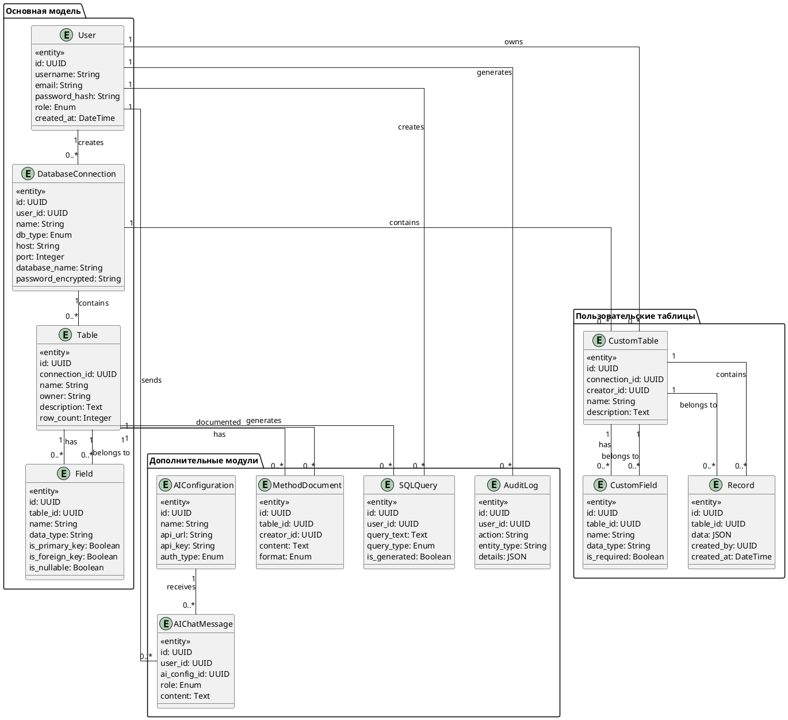

# МОДЕЛЬ ДАННЫХ И ER-ДИАГРАММА

## 1. Сущности системы

### 1.1. User (Пользователь)
```
┌─────────────────────────────────────────────────────────┐
│                        User                              │
├─────────────────────────────────────────────────────────┤
│ id: UUID (PK)                                           │
│ username: String (unique)                               │
│ email: String (unique)                                  │
│ password_hash: String                                   │
│ role: Enum (ADMIN, USER)                                │
│ created_at: DateTime                                    │
│ updated_at: DateTime                                    │
│ is_active: Boolean                                      │
└─────────────────────────────────────────────────────────┘
```

### 1.2. DatabaseConnection (Подключение к БД)
```
┌─────────────────────────────────────────────────────────┐
│                  DatabaseConnection                      │
├─────────────────────────────────────────────────────────┤
│ id: UUID (PK)                                           │
│ user_id: UUID (FK -> User)                              │
│ name: String                                            │
│ db_type: Enum (POSTGRES, MYSQL, SQLITE, SQLSERVER)      │
│ host: String                                            │
│ port: Integer                                           │
│ database_name: String                                   │
│ username: String                                        │
│ password_encrypted: String                              │
│ is_default: Boolean                                     │
│ created_at: DateTime                                    │
│ last_connected: DateTime                                │
└─────────────────────────────────────────────────────────┘
```

### 1.3. Table (Таблица в внешней БД)
```
┌─────────────────────────────────────────────────────────┐
│                        Table                             │
├─────────────────────────────────────────────────────────┤
│ id: UUID (PK)                                           │
│ connection_id: UUID (FK -> DatabaseConnection)          │
│ name: String                                            │
│ owner: String                                           │
│ description: Text                                       │
│ created_at: DateTime                                    │
│ updated_at: DateTime                                    │
│ row_count: Integer                                      │
└─────────────────────────────────────────────────────────┘
```

### 1.4. Field (Поле таблицы)
```
┌─────────────────────────────────────────────────────────┐
│                        Field                             │
├─────────────────────────────────────────────────────────┤
│ id: UUID (PK)                                           │
│ table_id: UUID (FK -> Table)                            │
│ name: String                                            │
│ data_type: String                                       │
│ is_primary_key: Boolean                                 │
│ is_foreign_key: Boolean                                 │
│ is_nullable: Boolean                                    │
│ default_value: String                                   │
│ max_length: Integer                                     │
│ references_table: String (FK target)                    │
│ references_field: String (FK target field)              │
└─────────────────────────────────────────────────────────┘
```

### 1.5. CustomTable (Пользовательская таблица)
```
┌─────────────────────────────────────────────────────────┐
│                    CustomTable                           │
├─────────────────────────────────────────────────────────┤
│ id: UUID (PK)                                           │
│ connection_id: UUID (FK -> DatabaseConnection)          │
│ creator_id: UUID (FK -> User)                           │
│ name: String                                            │
│ description: Text                                       │
│ created_at: DateTime                                    │
│ updated_at: DateTime                                    │
│ is_active: Boolean                                      │
└─────────────────────────────────────────────────────────┘
```

### 1.6. CustomField (Поле пользовательской таблицы)
```
┌─────────────────────────────────────────────────────────┐
│                    CustomField                           │
├─────────────────────────────────────────────────────────┤
│ id: UUID (PK)                                           │
│ table_id: UUID (FK -> CustomTable)                      │
│ name: String                                            │
│ data_type: String                                       │
│ is_required: Boolean                                    │
│ default_value: String                                   │
└─────────────────────────────────────────────────────────┘
```

### 1.7. Record (Запись в пользовательской таблице)
```
┌─────────────────────────────────────────────────────────┐
│                        Record                            │
├─────────────────────────────────────────────────────────┤
│ id: UUID (PK)                                           │
│ table_id: UUID (FK -> CustomTable)                      │
│ data: JSON                                              │
│ created_by: UUID (FK -> User)                           │
│ created_at: DateTime                                    │
└─────────────────────────────────────────────────────────┘
```

### 1.8. SQLQuery (Сохранённый SQL запрос)
```
┌─────────────────────────────────────────────────────────┐
│                     SQLQuery                             │
├─────────────────────────────────────────────────────────┤
│ id: UUID (PK)                                           │
│ user_id: UUID (FK -> User)                              │
│ connection_id: UUID (FK -> DatabaseConnection)          │
│ table_id: UUID (FK -> Table)                            │
│ query_text: Text                                        │
│ query_type: Enum (SELECT, INSERT, CREATE)               │
│ is_generated: Boolean                                   │
│ created_at: DateTime                                    │
└─────────────────────────────────────────────────────────┘
```

### 1.9. MethodDocument (Методика ведения таблицы)
```
┌─────────────────────────────────────────────────────────┐
│                   MethodDocument                         │
├─────────────────────────────────────────────────────────┤
│ id: UUID (PK)                                           │
│ table_id: UUID (FK -> Table)                            │
│ creator_id: UUID (FK -> User)                           │
│ content: Text                                           │
│ format: Enum (TXT, PDF)                                 │
│ created_at: DateTime                                    │
│ updated_at: DateTime                                    │
└─────────────────────────────────────────────────────────┘
```

### 1.10. AuditLog (Журнал действий)
```
┌─────────────────────────────────────────────────────────┐
│                     AuditLog                             │
├─────────────────────────────────────────────────────────┤
│ id: UUID (PK)                                           │
│ user_id: UUID (FK -> User)                              │
│ action: String                                          │
│ entity_type: String                                     │
│ entity_id: String                                       │
│ details: JSON                                           │
│ ip_address: String                                      │
│ created_at: DateTime                                    │
└─────────────────────────────────────────────────────────┘
```

### 1.11. AIConfiguration (Настройка ИИ-агента)
```
┌─────────────────────────────────────────────────────────┐
│                   AIConfiguration                        │
├─────────────────────────────────────────────────────────┤
│ id: UUID (PK)                                           │
│ name: String                                            │
│ api_url: String                                         │
│ api_key: String (encrypted)                             │
│ auth_type: Enum (NONE, API_KEY, OAUTH)                  │
│ is_active: Boolean                                      │
│ created_at: DateTime                                    │
│ updated_at: DateTime                                    │
└─────────────────────────────────────────────────────────┘
```

### 1.12. AIChatMessage (Сообщение чата с ИИ)
```
┌─────────────────────────────────────────────────────────┐
│                   AIChatMessage                          │
├─────────────────────────────────────────────────────────┤
│ id: UUID (PK)                                           │
│ user_id: UUID (FK -> User)                              │
│ ai_config_id: UUID (FK -> AIConfiguration)              │
│ role: Enum (USER, ASSISTANT)                            │
│ content: Text                                           │
│ created_at: DateTime                                    │
└─────────────────────────────────────────────────────────┘
```

## 2. ER-ДИАГРАММА (PlantUML)



## 3. СХЕМА СВЯЗЕЙ

### 3.1. Основные связи
```
User (1) ────< (N) DatabaseConnection
User (1) ────< (N) CustomTable
User (1) ────< (N) SQLQuery
User (1) ────< (N) AIChatMessage
User (1) ────< (N) AuditLog

DatabaseConnection (1) ────< (N) Table
DatabaseConnection (1) ────< (N) CustomTable

Table (1) ────< (N) Field
Table (1) ────< (N) SQLQuery
Table (1) ────< (N) MethodDocument

CustomTable (1) ────< (N) CustomField
CustomTable (1) ────< (N) Record

AIConfiguration (1) ────< (N) AIChatMessage
```

### 3.2. Ограничения целостности
1. **CASCADE DELETE** для связанных записей при удалении пользователя
2. **RESTRICT** для удаления таблиц с данными
3. **ON UPDATE CASCADE** для изменения первичных ключей
4. **CHECK constraints** для валидации данных

## 4. ИНДЕКСЫ

### 4.1. Обязательные индексы
```sql
-- User
CREATE INDEX idx_user_username ON User(username);
CREATE INDEX idx_user_email ON User(email);

-- DatabaseConnection
CREATE INDEX idx_db_connection_user ON DatabaseConnection(user_id);
CREATE INDEX idx_db_connection_type ON DatabaseConnection(db_type);

-- Table
CREATE INDEX idx_table_connection ON Table(connection_id);
CREATE INDEX idx_table_name ON Table(name);

-- Field
CREATE INDEX idx_field_table ON Field(table_id);

-- CustomTable
CREATE INDEX idx_custom_table_creator ON CustomTable(creator_id);
CREATE INDEX idx_custom_table_connection ON CustomTable(connection_id);

-- Record
CREATE INDEX idx_record_table ON Record(table_id);
CREATE INDEX idx_record_creator ON Record(created_by);

-- AuditLog
CREATE INDEX idx_audit_user ON AuditLog(user_id);
CREATE INDEX idx_audit_action ON AuditLog(action);
CREATE INDEX idx_audit_time ON AuditLog(created_at);

-- AIChatMessage
CREATE INDEX idx_ai_message_user ON AIChatMessage(user_id);
CREATE INDEX idx_ai_message_config ON AIChatMessage(ai_config_id);
```

## 5. ВИДЫ (VIEWS)

### 5.1. Полный обзор таблицы
```sql
CREATE VIEW v_table_full_info AS
SELECT 
    t.id as table_id,
    t.name as table_name,
    t.owner,
    t.description,
    t.row_count,
    dc.name as connection_name,
    u.username as creator,
    COUNT(DISTINCT f.id) as field_count,
    COUNT(DISTINCT CASE WHEN f.is_primary_key THEN 1 END) as pk_count,
    COUNT(DISTINCT CASE WHEN f.is_foreign_key THEN 1 END) as fk_count
FROM Table t
JOIN DatabaseConnection dc ON t.connection_id = dc.id
JOIN User u ON dc.user_id = u.id
LEFT JOIN Field f ON t.id = f.table_id
GROUP BY t.id, dc.name, u.username;
```

### 5.2. Активность пользователей
```sql
CREATE VIEW v_user_activity AS
SELECT 
    u.id as user_id,
    u.username,
    u.role,
    COUNT(DISTINCT al.id) as total_actions,
    COUNT(DISTINCT CASE WHEN al.action = 'db_connect' THEN 1 END) as connections,
    COUNT(DISTINCT CASE WHEN al.action = 'table_create' THEN 1 END) as tables_created,
    MAX(al.created_at) as last_activity
FROM User u
LEFT JOIN AuditLog al ON u.id = al.user_id
GROUP BY u.id, u.username, u.role;
```

---
**Версия:** 1.0
**Дата:** 2024
**Статус:** На согласовании
